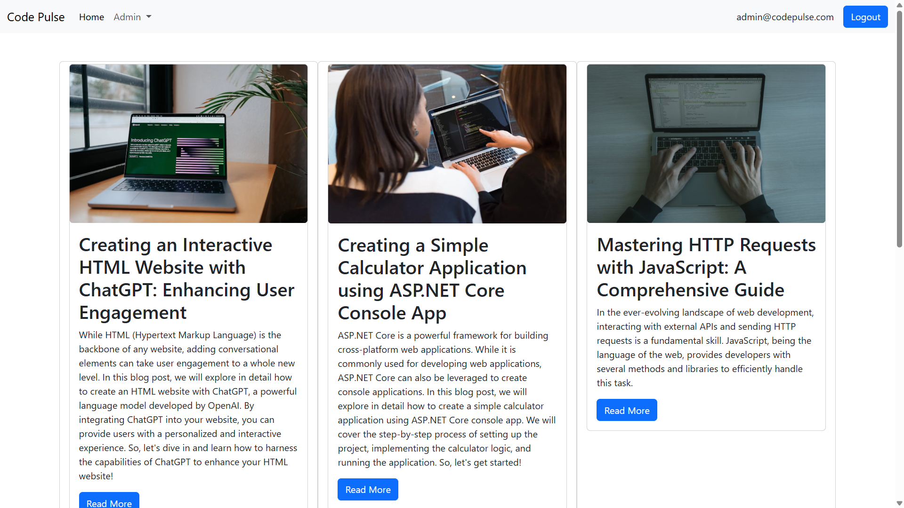
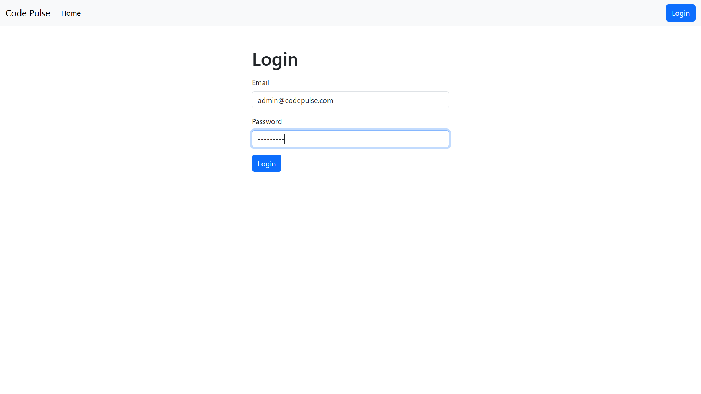
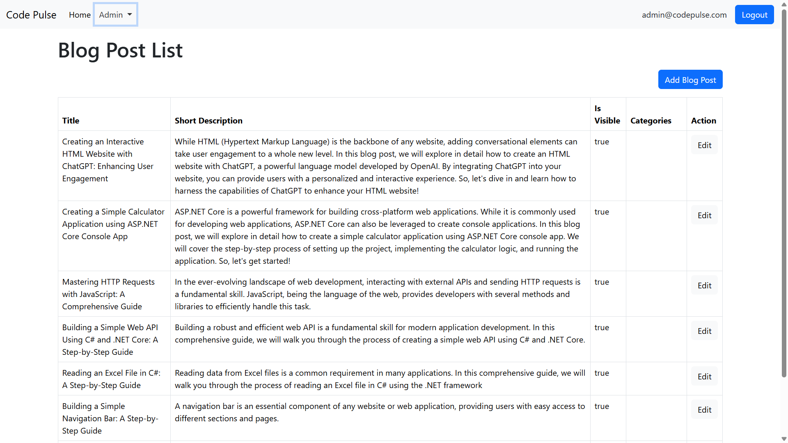
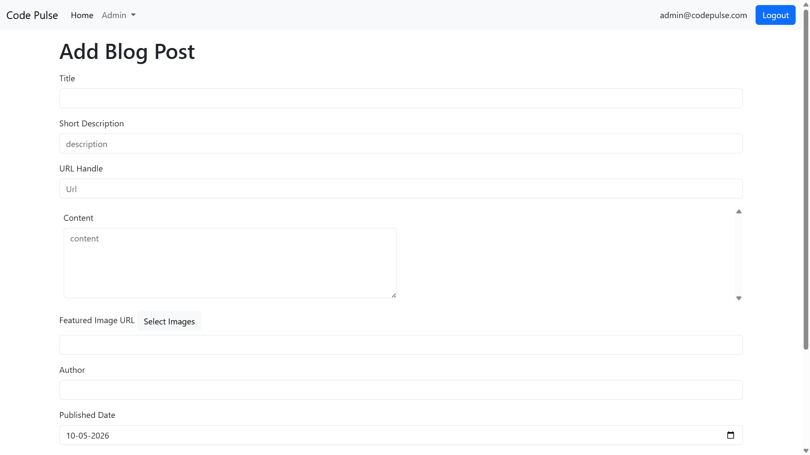
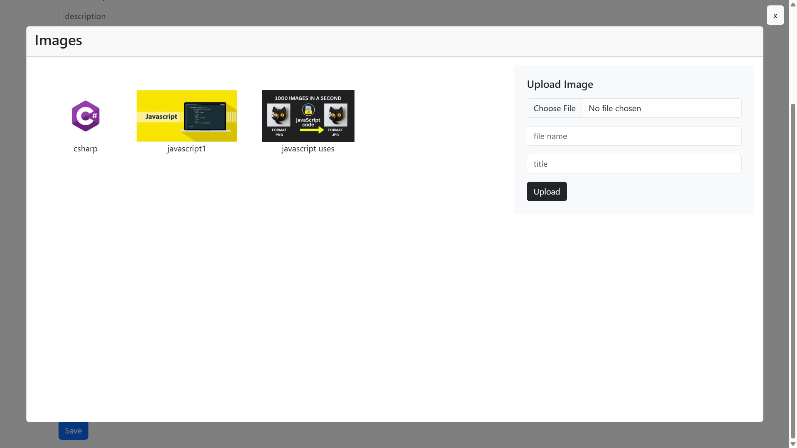
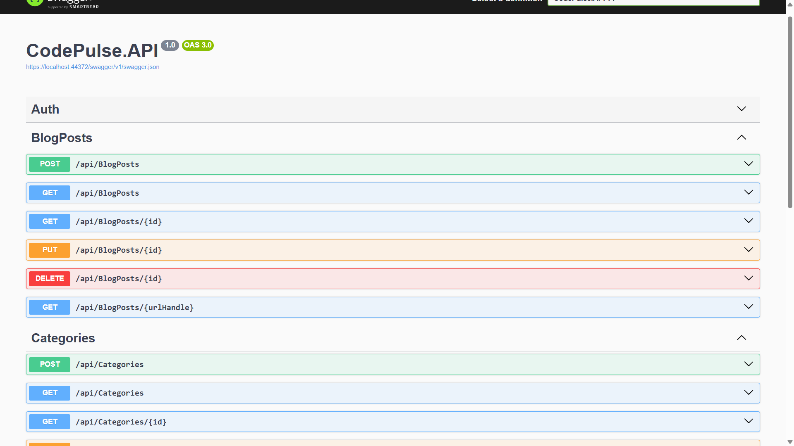

# CodePulse Blog Platform

CodePulse is a full-stack blog management platform developed using Angular and ASP.NET Core Web API. The project was built to implement modern frontend and backend development practices including RESTful APIs, JWT authentication, modular architecture, repository pattern, image upload functionality, and protected routes.

The platform allows administrators to manage blogs and categories securely while providing a separate public interface for users to browse and read blog posts.

---

## Project Overview

The application is divided into two major parts:

* Frontend developed using Angular
* Backend developed using ASP.NET Core Web API

The frontend communicates with the backend APIs to perform blog management operations, authentication, category handling, and image uploads.

The project follows a modular and scalable architecture to maintain separation of concerns and improve maintainability.

---

# Features

## Authentication and Authorization

* JWT-based authentication
* Secure login and logout functionality
* Protected admin routes using Angular route guards
* Authorization-enabled API endpoints

## Blog Management

* Create blog posts
* Update blog posts
* Delete blog posts
* View complete blog details
* Public blog listing page

## Category Management

* Add categories
* Edit categories
* Delete categories
* Associate categories with blog posts

## Image Upload Functionality

* Upload blog images
* Image preview before selection
* Shared reusable image selector component

## Frontend Architecture

* Feature-based Angular structure
* Shared and reusable components
* Service-based API communication
* Route-based navigation

## Backend Architecture

* Repository pattern implementation
* DTO-based request and response handling
* Entity Framework Core integration
* SQL Server database integration
* Separate authentication database context

---

# Technology Stack

## Frontend

* Angular
* TypeScript
* HTML
* CSS
* RxJS

## Backend

* ASP.NET Core Web API
* Entity Framework Core
* SQL Server
* JWT Authentication

## Development Tools

* Git
* GitHub
* Visual Studio
* Visual Studio Code

---

# Project Structure

```bash id="0f8e4v"
CodePulse/
│
├── API2/
│   └── CodePulse.API/
│       ├── Controllers/
│       ├── Data/
│       ├── Models/
│       ├── Repositories/
│       ├── Migrations/
│       └── Program.cs
│
├── UI2/
│   └── CodePulse/
│       ├── src/app/core/
│       ├── src/app/features/
│       ├── src/app/shared/
│       └── src/environments/
```

---

# Key Concepts Implemented

* RESTful API development
* Repository pattern
* DTO architecture
* JWT authentication
* Angular route guards
* Dependency injection
* Entity Framework Core migrations
* Modular frontend architecture
* Shared reusable components

---

# Getting Started

## Clone Repository

```bash id="8v7r3m"
git clone https://github.com/sesadri1/codepulse-blogpost-platform.git
```

---

# Backend Setup

## Navigate to backend project

```bash id="i9x1wr"
cd API2/CodePulse.API/CodePulse.API
```

## Restore dependencies

```bash id="zt3qg1"
dotnet restore
```

## Apply database migrations

```bash id="gr7e1f"
dotnet ef database update
```

## Run backend server

```bash id="f0g5lw"
dotnet run
```

---

# Frontend Setup

## Navigate to frontend project

```bash id="n6y4pk"
cd UI2/CodePulse
```

## Install dependencies

```bash id="3v0x2d"
npm install
```

## Run Angular application

```bash id="j4e8mt"
ng serve
```

---

# Application URLs

## Frontend

```plaintext id="9m1e4q"
http://localhost:4200
```

## Backend API

```plaintext id="1p4k8v"
https://localhost:xxxx
```

---

# Current Improvements in Progress

* Enhanced UI styling and responsiveness
* Blog "Read More" navigation improvements
* Additional frontend optimizations

---

# Planned Enhancements

* Pagination and filtering
* Search functionality
* Rich text editor integration
* Comment system
* Cloud deployment

---


## 📸 Screenshots
# Application Screenshots

## Home Page



---

## Login Page



---

## Blog Details Page



---

## Add BlogPost Page



---

## Image Upload Preview



---

## Swagger API Overview


*(Add screenshots here after running the project)*

# Author

## Sesadri Nayak


Aspiring Full Stack Developer with a focus on:

* Angular
* ASP.NET Core
* REST APIs
* Full Stack Web Development
* Scalable application architecture
